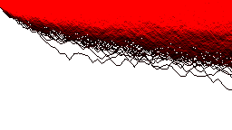
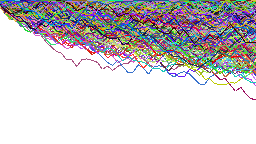

# Line-Density

A simple C++ with Direct3D version of [line-density](https://github.com/domoritz/line-density). The main idea is same, but the implementation is different.

## Optimization

We use texture that can read and write in shader(named RWTexture in Direct3D) to count the number of pixel in scan-line instead of read all texel from texture. If there are two lines are crossed at the same line-series, the count is two. But we need to use "interlock" to count.

We use `CPU` to build the vertex buffer of every line-series. We can use "LineStrip" mode to draw all lines in one line-series with one draw call. And we can render lines at merge stage instead of render a texture(the pixel we render lines less than we render a texture at usual). But we need to ensure to add density only once per pixel.

## Performance

The time to generate 10,000 line-series(1,000 lines, random) to 200x200 heatmap is 0.08s.

The time to generate 10,000 line-series(10,000 lines, random) to 200x200 heatmap is 0.52s.

The GPU is NVIDIA GTX 1060 6GB and the CPU is Intel i7-8650u. And the time is not include the data-generator.

## Issue

Wrong result with Intel Graphics Card. I had not find the reason. Maybe the driver is not right.

## Command

We can use command like `program_name -x param ...` to generate the heat map. 

- `-id`: input a string means the name of line data file.
- `-wl`: input a float means the width of line in output image.
- `-ic`: input a string means the name of color mapped file.
- `-rw`: input a uint means the width limit of random data(heatmap width).
- `-rh`: input a uint means the height limit of random data(heatmap height).
- `-rl`: input a uint means the number of lines in line-series(random data).
- `-rs`: input a uint means the number of line-series(random data).
- `-lw`: input a uint means the width of output image.
- `-lh`: input a uint means the height of output image.
- `-om`: input a string means the output heatmap file name.
- `-ol`: input a string means the output image file name.
- `-od`: input a string means the output line data file name(generate randomly).
- `-oc`: input a string means the output color mapped file name.

For example. we can generate a 200x200 heatmap and a 1280x720 image with 1000 line-series(50 lines). `program_name -om heatmap_name -ol image_name -rs 1000 -rl 50 -rw 200 -rh 200 -lw 1280 -lh 720`.

## File Format

There are "line data" file and "color mapped" file. "line data" file include the heatmap size, number of line-series, color of line-series. "color mapped" file include the colors that we mapped the density to, a space means the distance between two colors. For example, we have two colors(from black to red) and the space is 15.0f. So the color of pixel whose density is 7.5f is (0.5f, 0.0f, 0.0f)(half of red).

"line data" file format:

- 1st line: number of line-series(n), width of heatmap, height of heatmap.
- 2nd line to (n + 1)th line: number of lines, point_0_x, point_0_y, point_1_x, point_1_y ... point_n_x, point_n_y, red, green, blue, alpha.

"color mapped" file format:

- 1st line: number of colors(n), space.
- 2nd line to (n + 1)th line: red, green, blue, alpha.

## Example

1000 line-series(50 lines) from (0.0f, 0.0f, 0.0f, 1.0f) to (1.0f, 0.0f, 0.0f, 1.0f) with space 15.0f.

